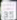

# Udacity Term 2 Robotic Inference Project

<hr>

## Introduction

This project consists of two parts:

1. Classification training of the supplied P1 dataset of bottles and candy wrappers - the "P1" dataset.
2. Creation of a Robotic Inference Idea. In this case a traffic sign classification idea was chosen. These images are in the "TrafficSigns" dataset.

<hr>

## Part One "P1"

## Background / Formulation

The P1 dataset consists of images of bottles and candy wrappers on a conveyor belt passing under a camera. The idea is to sort the items into two bins by activating a swing arm that guides the products to the right bin. The applications of such a recognition system are many, including including for example classification sorting, or identifying defective products.

The P1 dataset was created from the /data/P1/ directory using DIGITS. The images were chosen to be 256x256 color images. The model was chosen as a classification model as it most closely fits the requirements of the project. Two classification models were tested - AlexNet and GoogLeNet. AlexNet did not perform to the rubric requirements and will not be further discussed here. GoogLeNet did achieve the project goals of inference in less than 10ms and greater than 75% accuracy.

The model was built as shown:
<p style="text-align:center">

</p>
<p style="text-align:center">

</p>

No parameters were changed from the DIGITS defaults.

## Data Acquisition

The P1 dataset was provided by Udacity and no processing was required. THe training and validation datasets were created as 256x256 color images.


## Results

The **evaluate** results are:


The model clearly passes the project requirements of > 75% acccuracy and procesing time of less than 10ms.

The training accuracy graph as given by the model is:


Sample classification results show good accuracy:


Sample classified images:


## Discussion

This is the only section of the report where you may include your opinion. However, make sure your opinion is based on facts. If your results are poor, make mention of what may be the underlying issues. If the results are good, why do you think this is the case? Again, avoid writing in the first person (i.e. Do not use words like “I” or “me”). If you really find yourself struggling to avoid the word “I” or “me”; sometimes, this can be avoided with the use of the word “one”. As an example: instead of, "I think the accuracy on my dataset is low because the images are too small to show the necessary detail" try, "one may believe the accuracy on the dataset is low because the images are too small to show the necessary detail". They say the same thing, but the second avoids the first person.

Reflect on which is more important, inference time or accuracy, in regards to your robotic inference project.

## Conclusion / Future Work

This section is intended to summarize your report. Your summary should include a recap of the results, did this project achieve what you attempted, and is this a commercially viable product? For future work, address areas of work that you may not have addressed in your report as possible next steps. This could be due to time constraints, lack of currently developed methods / technology, and areas of application outside of your current implementation. Again, avoid the use of the first-person.


<hr>

## Part Two "Traffic Signs"

## Background / Formulation

This idea was motivated by an interest in autonomous vehicle control. Many lives can be saved on the highways and roadways if the vehicle can monitor unsafe situations and assist in controlling the vehicle. The idea is to recognize traffic signs such as stop, yeild and speed limit signs. Should the driver ignore or not see a stop or yield sign, the autonomous control can take over to ensure vehicle safety. In the case that spped limits are being violated, the vehicle can modify the vehicle speed or advise the driver to do so.

The deployment idea is to create a model classifying traffic signs, download it to a processor such as a Jetson TX2 or perhaps even an iPhone and have it monitor and advise live driving.

Three classification models were created using standard DIGITS models: AlexNet, GoogLeNet and LeNet. Classification models were chosen as most suitable the the project idea: classifiy traffic signs into known categories.

The sign images were converted to 256x256 pixels for AlexNet and GoogLeNet, and converted to 32x32 pixels for LeNet. All images were converted to grayscale.

## Data Acquisition

The LISA dataset contains over 7,000 traffic sign images. This dataset was chosen for the reality of the images (many signs are small, occluded, blurry, etc) and its sheer volume fo images. While the rubric for the project specifies at least 3 classes of images, 4 classes were chosen. The classes are **stop**, **yield**, **speedLimit25** and **speedLimit35**. The first two classes were chosen due to their imoprtance for vehicle safety. The second two were chosen to set a challenge level of difficuly in distinguishing 25 from 35.

These are examples of raw images of the 4 classes of signs chosen:

<div style="text-align:center">
<table>
    <tr>
        <th colspan=2>Raw Traffic Sign Images</th>
    </tr>
    <tr>
        <th>Speed Limit 25</th><th>Speed Limit 35</th>
    </tr>
    <tr>
        <td>
            <a href="images/speedLimit25_1333394492.avi_image2.png" target=_blank></a>
        </td>
        <td>
            <a href="images/speedLimit35_1333393073.avi_image7.png" target=_blank></a>
        </td>
    </tr>
    <tr>
        <th>Yield</th><th>Stop</th>
    </tr>
    <tr>
        <td>
            <a href="images/syield_1333395823.avi_image7.png" target=_blank></a>
        </td>
        <td>
            <a href="images/stop_1333388384.avi_image0.png" target=_blank></a>
        </td>
    </tr>
</table>
</div>

The images are processed by a bash script (<a href="doit.sh">doit.sh</a>) that I wrote that calls Python tools included with the LISA distribution. The script first merges individual subdirectory CSV annotation files into a single CSV (Comma Separated Values) index file that references the images in all of the subdirectories of the LISA distribution. It then splits the merged file into 80% training and 20% validation image sets. It then crops the actual sign faces into small (about 32x32 pixel) image sets for training and validation that is uploaded to the DIGITS directory. 

The LISA CSV annotation file contains useful fields that reference the source image, tag and coordinates of the sign:

```
Filename;Annotation tag;Upper left corner X;Upper left corner Y;Lower right corner X;Lower right corner Y;Occluded,On another road;Origin file;Origin frame number;Origin track;Origin track frame number
```

Only the file name, the annotation tag and the sign image coordinates are used to create the test and validation datasets.

The processed images are cropped from the raw data to contain just the sign faces:

<div style="text-align:center">
<table>
    <tr>
        <th colspan=2>Processed Traffic Sign Images</th>
    </tr>
    <tr>
        <th>Speed Limit 25</th><th>Speed Limit 35</th>
    </tr>
    <tr>
        <td>
            <a href="images/276_speedLimit_1324866665.avi_image0.png" target=_blank></a>
        </td>
        <td>
            <a href="images/416_speedLimit_1324866807.avi_image0.png" target=_blank></a>
        </td>
    </tr>
    <tr>
        <th>Yield</th><th>Stop</th>
    </tr>
    <tr>
        <td>
            <a href="images/176_yield_1323816786.avi_image19.png" target=_blank></a>
        </td>
        <td>
            <a href="images/1410_stop_1324866481.avi_image15.png" target=_blank></a>
        </td>
    </tr>
</table>
</div>

The raw and processed images are mixture of grayscale and color images. The DIGITS DataSet creation process converts all the images to grayscale. The processed images are cropped to a comomn size of 32x32 pixels in DIGITS.

The count of **training** images for each class are:

<div style="text-align:center">
<table>
    <tr>
        <th colspan=2>Training Traffic Sign Image Counts</th>
    </tr>
    <tr>
        <th>Tag</th><th>Count</th>
    </tr>
    <tr>
        <td>stop</td><td>1413</td>
    </tr>
    <tr>
        <td>yield</td><td>85</td>
    </tr>
    <tr>
        <td>speedLimit25</td><td>245</td>
    </tr>
    <tr>
        <td>speedLimit35</td><td>404</td>
    </tr>
</table>
</div>

The count of **validation** images for each class are:

<div style="text-align:center">
<table>
    <tr>
        <th colspan=2>Validation Traffic Sign Image Counts</th>
    </tr>
    <tr>
        <th>Tag</th><th>Count</th>
    </tr>
    <tr>
        <td>stop</td><td>381</td>
    </tr>
    <tr>
        <td>yield</td><td>18</td>
    </tr>
    <tr>
        <td>speedLimit25</td><td>63</td>
    </tr>
    <tr>
        <td>speedLimit35</td><td>114</td>
    </tr>
</table>
</div>

The split in number of training / validation images was set at 80% / 20% in the doit.sh bash script.

While the raw images in the LISA dataset were used to create the training and validation set, the test dataset was taken independently using an iPhone.

<div style="text-align:center">
<table>
    <tr>
        <th colspan=2>Test Traffic Sign Images</th>
    </tr>
    <tr>
        <th>Speed Limit 25</th><th>Speed Limit 35</th>
    </tr>
    <tr>
        <td>
            <a href="images/" target=_blank></a>
        </td>
        <td>
            <a href="images/" target=_blank></a>
        </td>
    </tr>
    <tr>
        <th>Yield</th><th>Stop</th>
    </tr>
    <tr>
        <td>
            <a href="images/" target=_blank></a>
        </td>
        <td>
            <a href="images/stop_test_001.png" target=_blank></a>
        </td>
    </tr>
</table>
</div>

## Results

The TrafficSigns dataset was created as follows:


THe only difference between LeNet vs GoogLeNet / AlexNet datasets was that the former images size was stretched to 32x32 and the latter 256x256 pixels.

The results for AlexNet and GoogLeNet as shown below were poor. AlexNet achieved only 80% accuracy:


GoogLeNet acheived about 90% accuracy:


These models will not be discussed further. 

LeNet gave excellent results and will be dicussed in more detail. LeNet gave an accuracy of almost 100%:


This image shows a portion of the training dataset:


This image shows a portion of the validation dataset:


The LeNet model was used with no modifications in DIGITS:


This image shows sample classification results:


The results are very encouraging, as the distinction between speedLimit25 and speedLimit35 is clearly being made with high accuracy, typically over 99%.

## Discussion

This is the only section of the report where you may include your opinion. However, make sure your opinion is based on facts. If your results are poor, make mention of what may be the underlying issues. If the results are good, why do you think this is the case? Again, avoid writing in the first person (i.e. Do not use words like “I” or “me”). If you really find yourself struggling to avoid the word “I” or “me”; sometimes, this can be avoided with the use of the word “one”. As an example: instead of, "I think the accuracy on my dataset is low because the images are too small to show the necessary detail" try, "one may believe the accuracy on the dataset is low because the images are too small to show the necessary detail". They say the same thing, but the second avoids the first person.

Reflect on which is more important, inference time or accuracy, in regards to your robotic inference project.

## Conclusion / Future Work

This section is intended to summarize your report. Your summary should include a recap of the results, did this project achieve what you attempted, and is this a commercially viable product? For future work, address areas of work that you may not have addressed in your report as possible next steps. This could be due to time constraints, lack of currently developed methods / technology, and areas of application outside of your current implementation. Again, avoid the use of the first-person.

Your report must be in PDF format. You may use any method to produce this format. If you are looking for a challenge, you can create your project report in LaTeX and then export the report to pdf. Here’s a sample LaTeX report. It’s a fun way to create well formatted documents!

## References

[1] Sayanan Sivaraman and Mohan M. Trivedi, "A General Active Learning Framework for On-road Vehicle Recognition and Tracking," IEEE Transactions on Intelligent Transportation Systems, 2010.

[2] Eshed Ohn-Bar and Mohan M. Trivedi, "Hand Gesture Recognition in Real-Time for Automotive Interfaces: A Multimodal Vision-based Approach and Evaluations," IEEE Transactions on Intelligent Transportation Systems, 2014. 

[3] Andreas Møgelmose, Mohan M. Trivedi, and Thomas B. Moeslund, "Vision based Traffic Sign Detection and Analysis for Intelligent Driver Assistance Systems: Perspectives and Survey," IEEE Transactions on Intelligent Transportation Systems, 2012.

[4] Morten Bornø Jensen, Mark Philip Philipsen, Andreas Møgelmose, Thomas B Moeslund, and Mohan M Trivedi. “Vision for Looking at Traffic Lights: Issues, Survey, and Perspectives”. In: IEEE Transactions on Intelligent Transportation Systems (2015).

[5] Mark Philip Philipsen, Morten Bornø Jensen, Andreas Møgelmose, Thomas B Moeslund, and Mohan M Trivedi. “Learning Based Traffic Light Detection: Evaluation on Challenging Dataset”. In: 18th IEEE Intelligent Transportation Systems Conference (2015).


