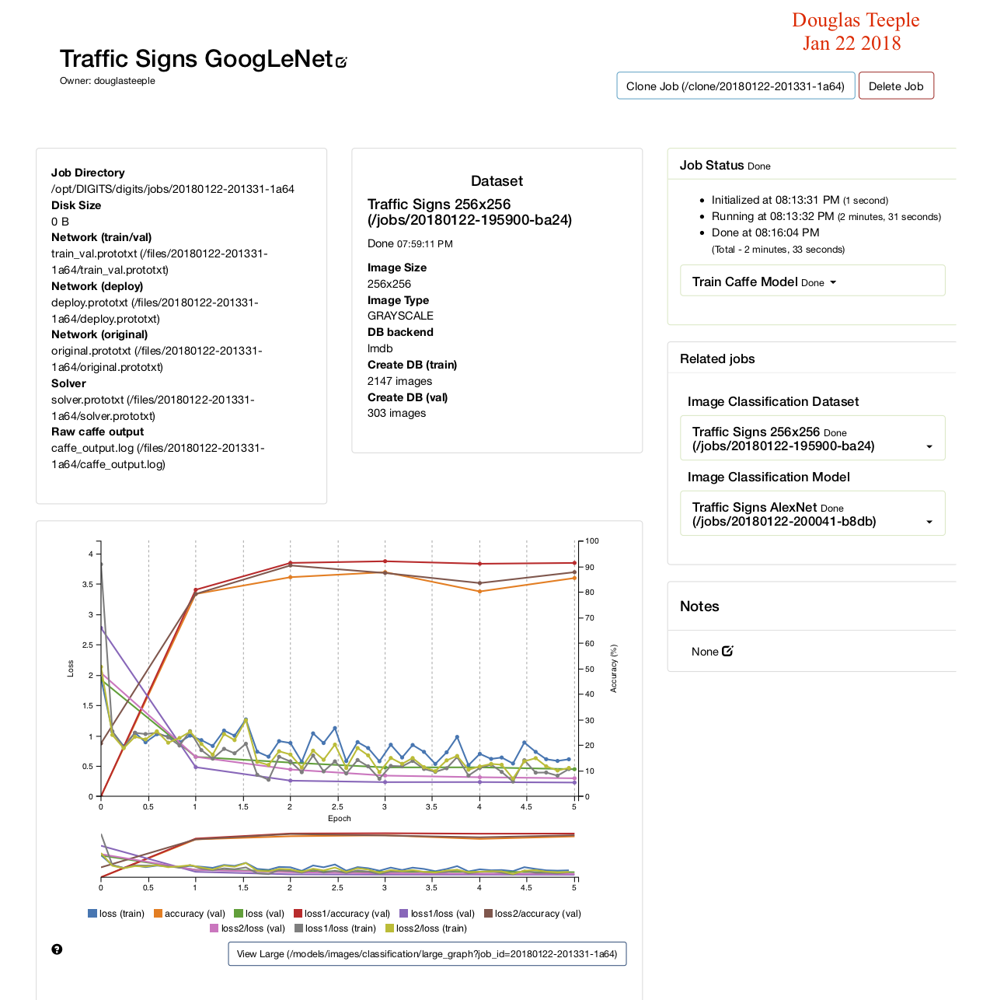
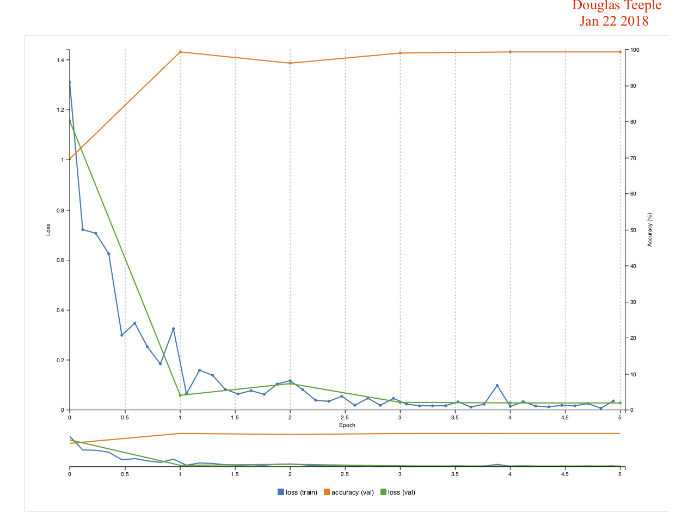
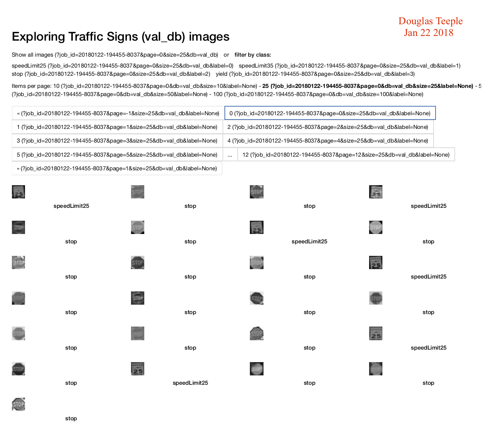

# Udacity Term 2 Robotic Inference Project

<hr>

## Abstract

Two image classification deep neural network projects are presented. The first is a classification model of a given dataset of images of bottles, candy wrappers and nothing on a conveyor belt. The model is trained to classify images into one of the three classes from the given dataset. The process of building the dataset, creating the model and the results of testing are given. The second is a traffic sign dataset from the LISA publically available dataset and test images taken independently. The model is to classify images containing traffic signs into stop, yield, speed limit 25 and speed limit 35 classes. THe process of extracting sign faces from the 7,000+ images dataset is documented. Three models are tested; AlexNet, GoogLeNet and LeNet. Results show that LeNet provides the best traffic sign classification, likely due to a good "impedance" match between the preferred image size of LeNet and the trafic sign face images.

## Introduction

This document describes the Udacity Term 2 Robotic Inference project. The project consists of two parts:

1. Classification training of the supplied P1 dataset of bottles, candy wrappers and an empty conveyor belt - the "P1" dataset.
2. Creation of a Robotic Inference idea. In this case a traffic sign classification idea was chosen. The images are in the "TrafficSigns" dataset.

The follwoing sections describe the steps taken in preparing the data, developing the model and testing the model and the results achieved in implementing each of these projects.

<hr>

## Part One "P1 Conveyor Belt Image Classification"

## Background / Formulation

The P1 dataset consists of images of bottles, candy wrappers and no object on a conveyor belt passing under a camera. The idea is to sort the items into bins by activating a swing arm that guides the products to the right bin. The applications of such a recognition system are many, including including, for example, classification sorting or identifying defective products.

The P1 dataset was created from the /data/P1/ directory using DIGITS. The images were chosen to be 256x256 color images. The model was chosen as a classification model as it most closely fits the requirements of the project. Two classification models were tested - AlexNet and GoogLeNet. AlexNet did not perform to the rubric requirements and will not be further discussed here. GoogLeNet did achieve the project goals of inference in less than 10ms and greater than 75% accuracy.

The model was built as shown:
<table><tr><td>
    
</td></tr></table>
<table><tr><td>
    
</td></tr></table>

The only parameter changed from the DIGITS defaults was the number of epochs which was set to 5.

## Data Acquisition

The P1 dataset was provided by Udacity and no processing was required. THe training and validation datasets were created as 256x256 color images. Both grayscale and color images were tested, with the same model.


## Results

The **evaluate** results for color images are:

<table><tr><td>
    
</td></tr></table>

The model clearly passes the project requirements of > 75% acccuracy and procesing time of less than 10ms.

The training accuracy graph as given by the model is:


Sample classification results show good accuracy:

<table><tr><td>
    
</td></tr></table>

Sample classified images:

<table><tr><td>
    
</td></tr></table>

Both grayscale and color images were tested. It was found that grayscale could only achieve about 72% accuracy, so color images were used.

The model can be found <a href="P1/GoogLeNet/model/20180123-001517-751c_epoch_5.0/" target=_blank>here</a>.

## Discussion

The GoogLeNet model performed well on 256x256 color imagaes, meeting the project requirements. In the case of a conveyor belt moving at the speed shown in the class, clearly the 5ms decision time is adequate for the sorting job. So in this case, accuracy is more important than inference speed, as long as it is kept less than perhaps 1/2 second.

## Conclusion / Future Work

A trained model sorting into 3 classes clearly has the speed and accuracy to sort objects on a conveyor belt. Further work might extend the number of classes of objects into the realm of 10 or perhaps 100. Of course, the number of classes into which the images must be classified depends on the actual application as deployed in the real world.


<hr>

## Part Two "Traffic Signs"

## Background / Formulation

This idea was motivated by an interest in autonomous vehicle control. Many lives can be saved on the highways and roadways if the vehicle can monitor unsafe situations and assist in controlling the vehicle. The idea is to recognize traffic signs such as stop, yeild and speed limit signs. Should the driver ignore or not see a stop or yield sign, the autonomous control can take over to ensure vehicle safety. In the case that spped limits are being violated, the vehicle can modify the vehicle speed or advise the driver to do so.

The deployment idea is to create a model classifying traffic signs, download it to a processor such as a Jetson TX2 or perhaps even an iPhone and have it monitor and advise live driving.

Three classification models were created using standard DIGITS models: AlexNet, GoogLeNet and LeNet. Classification models were chosen as most suitable the the project idea: classifiy traffic signs into known categories.

The sign images were converted to 256x256 pixels for AlexNet and GoogLeNet, and converted to 32x32 pixels for LeNet. All images were converted to grayscale.

## Data Acquisition

The <a href="http://cvrr.ucsd.edu/LISA/lisa-traffic-sign-dataset.html">LISA</a> dataset contains over 7,000 traffic sign images. This dataset was chosen for the reality of the images (many signs are small, occluded, blurry, etc) and its sheer volume fo images. The images were taken from frames of movies taken from a vehicle on actual streets, sometimes stationary and sometime mvoing. While the rubric for the project specifies at least 3 classes of images, 4 classes were chosen. The classes are **stop**, **yield**, **speedLimit25** and **speedLimit35**. The first two classes were chosen due to their imoprtance for vehicle safety. The second two were chosen to set a challenge level of difficuly in distinguishing 25 from 35.

These are examples of raw images of the 4 classes of signs chosen:

<div align=center>
<table>
    <tr>
        <th colspan=2>Raw Traffic Sign Images</th>
    </tr>
    <tr>
        <th>Speed Limit 25</th><th>Speed Limit 35</th>
    </tr>
    <tr>
        <td>
            <a href="images/speedLimit25_1333394492.avi_image2.png" target=_blank></a>
        </td>
        <td>
            <a href="images/speedLimit35_1333393073.avi_image7.png" target=_blank></a>
        </td>
    </tr>
    <tr>
        <th>Yield</th><th>Stop</th>
    </tr>
    <tr>
        <td>
            <a href="images/syield_1333395823.avi_image7.png" target=_blank></a>
        </td>
        <td>
            <a href="images/stop_1333388384.avi_image0.png" target=_blank></a>
        </td>
    </tr>
</table>
</div>

The images are processed by a bash script (<a href="doit.sh">doit.sh</a>) that I wrote that calls Python tools included with the LISA distribution. The script first merges individual subdirectory CSV annotation files into a single CSV (Comma Separated Values) index file that references the images in all of the subdirectories of the LISA distribution. It then splits the merged file into 80% training and 20% validation image sets. It then crops the actual sign faces into small (about 32x32 pixel) image sets for training and validation that is uploaded to the DIGITS directory. 

The LISA CSV annotation file contains useful fields that reference the source image, tag and coordinates of the sign:

```
Filename;Annotation tag;Upper left corner X;Upper left corner Y;Lower right corner X;Lower right corner Y;Occluded,On another road;Origin file;Origin frame number;Origin track;Origin track frame number
```

Only the file name, the annotation tag and the sign image coordinates are used to create the test and validation datasets.

The processed images are cropped from the raw data to contain just the sign faces:

<center>
<table style="float:right">
    <tr>
        <th colspan=2>Processed Traffic Sign Images</th>
    </tr>
    <tr>
        <th>Speed Limit 25</th><th>Speed Limit 35</th>
    </tr>
    <tr>
        <td>
            <a href="images/276_speedLimit_1324866665.avi_image0.png" target=_blank></a>
        </td>
        <td>
            <a href="images/416_speedLimit_1324866807.avi_image0.png" target=_blank></a>
        </td>
    </tr>
    <tr>
        <th>Yield</th><th>Stop</th>
    </tr>
    <tr>
        <td>
            <a href="images/176_yield_1323816786.avi_image19.png" target=_blank></a>
        </td>
        <td>
            <a href="images/1410_stop_1324866481.avi_image15.png" target=_blank></a>
        </td>
    </tr>
</table>
</center>

The raw and processed images are mixture of grayscale and color images. The DIGITS DataSet creation process converts all the images to grayscale. The processed images are stretched to a comomn size of 32x32 pixels in DIGITS.

The count of **training** images for each class are:

<center>
<table>
    <tr>
        <th colspan=2>Training Traffic Sign Image Counts</th>
    </tr>
    <tr>
        <th>Tag</th><th>Count</th>
    </tr>
    <tr>
        <td>stop</td><td>1413</td>
    </tr>
    <tr>
        <td>yield</td><td>85</td>
    </tr>
    <tr>
        <td>speedLimit25</td><td>245</td>
    </tr>
    <tr>
        <td>speedLimit35</td><td>404</td>
    </tr>
</table>
</denter>

The count of **validation** images for each class are:

<center>
<table>
    <tr>
        <th colspan=2>Validation Traffic Sign Image Counts</th>
    </tr>
    <tr>
        <th>Tag</th><th>Count</th>
    </tr>
    <tr>
        <td>stop</td><td>381</td>
    </tr>
    <tr>
        <td>yield</td><td>18</td>
    </tr>
    <tr>
        <td>speedLimit25</td><td>63</td>
    </tr>
    <tr>
        <td>speedLimit35</td><td>114</td>
    </tr>
</table>
</center>

The split in number of training / validation images was set at 80% / 20% in the doit.sh bash script.

While the raw images in the LISA dataset were used to create the training and validation set, the test dataset was taken independently using an iPhone.

<center>
<table width="100%">
    <tr>
        <th colspan=2>Test Traffic Sign Images</th>
    </tr>
    <tr>
        <th>Speed Limit 25</th><th>Speed Limit 35</th>
    </tr>
    <tr>
        <td>
            <a href="images/test/speedLimit25_test_001.png" target=_blank></a>
        </td>
        <td>
            <a href="images/test/speedLimit35_test_001.png" target=_blank></a>
        </td>
    </tr>
    <tr>
        <th>Yield</th><th>Stop</th>
    </tr>
    <tr>
        <td>
            <a href="images/test/yield_test_001.png" target=_blank></a>
        </td>
        <td>
            <a href="images/test/stop_test_001.png" target=_blank></a>
        </td>
    </tr>
        <th colspan=2>Other</th>
    </tr>
    <tr>
        <th>Pedestrian Crossing</th><th>Yield Ahead</th>
    </tr>
    <tr>
        <td>
            <a href="images/test/pedestrianCrossing_test_001.png" target=_blank></a>
        </td>
        <td>
            <a href="images/test/yieldAhead_test_001.png" target=_blank></a>
        </td>
    </tr>
</table>
</center>

## Results

The TrafficSigns dataset was created as follows:

<table><tr><td>
    
</td></tr></table>

The only difference between LeNet vs GoogLeNet / AlexNet datasets was that the LeNet images size was stretched to 32x32 and GoogLeNet / AlexNet was strecthed to 256x256 pixels. In all models the number of epochs parameter was set to 5.

The results for AlexNet and GoogLeNet as shown below were poor. AlexNet achieved only 80% accuracy:

<table><tr><td>
    
</td></tr></table>

GoogLeNet achieved about 90% accuracy:

<table><tr><td>
    
</td></tr></table>

These models will not be discussed further. 

LeNet gave excellent results and will be discussed in more detail. LeNet gave an accuracy of almost 100%:

<table><tr><td>
    
</td></tr></table>

This image shows a portion of the training dataset:

<table><tr><td>
    
</td></tr></table>

This image shows a portion of the validation dataset:

<table><tr><td>
    
</td></tr></table>

The LeNet model was used with no modifications in DIGITS:

<table><tr><td>
    
</td></tr></table>

This image shows sample classification results:

<table><tr><td>
    
</td></tr></table>

The results are very encouraging, as the distinction between speedLimit25 and speedLimit35, for example, is clearly being made with high accuracy, typically over 99%.

The model can be found <a href="TrafficSignsClassification/LeNet/model/20180122-195121-f6f2_epoch_5.0/" target=_blank>here</a>.


### Test Image Results

The model was loaded on to a Jetson TX2 and the test images analyzed.

## Discussion

Traffic sign classification is a difficult task. Images are typically blurry, small in the field of view, sometime occluded, often rotated or taken at odd angles. All of these factors make the inference process a challenge. Motion of the vehicle at highway speeds requires that the inferencing be done very quickly in order to be relevant. All of these factors contribute to make this project a real challenge.

LeNet gave the best results, perhaps due to a good "impedance" match between the sign face sizes and the image size used by LeNet which is 28x28 pixels. Each sign face is different in size, depending on the size of the sign in each raw image, but each is about 32x32 pixels, so very little stratching was needed. GoogLeNet and AlexNet expected an image size of 256x256 pixels. The extreme stratching of the sign faces made very blurry images, an consequently poor model results.

The availability of large numbers of images for training and validation is a valuable asset. The LISA dataset has over 7,000 real world images. The annotations CSV files were also a great asset, greatly simplifying the process of extracting sign faces.

In the case of imaging taken from a moving vehicle, perhaps at high speed, both accuracy and inference speed are equally important. Clearly, the decision must be made quickly to be relevant and a mistake in classification could be fatal.

A greater variety of traffic signs needs to be in the dataset and to be classified in order to be useful in the real world. There are perhaps in the order hundreds of different traffic signs. Any real world deployment would need to recognize this large number of classes.

## Conclusion / Future Work

The project was a success achieving typically 99% accuracy in classification. Further work would be in creating a larger dataset with more kinds of traffic signs and extending the model to classify perhaps hundreds of different signs.

One fascinating aspect of traffic signs is "dynamic" signs such as traffic lights. Grayscale images were used in this project because many self-driving automobiles are equpipped with only grayscale cameras. This present a challenge for distinguishing whether a traffic signal is "Red" or "Green". Persons that are color blind have a similar problem when driving, being unable to see red vs green color in the lights. However, "Red" is always the top light and green the bottom, so the light color can be distinguished from brightness of the top-most vs the bottom-most light. A model that specifically addresses traffic lights would be a fascinating follow-on project.

## References

[1] Sayanan Sivaraman and Mohan M. Trivedi, "A General Active Learning Framework for On-road Vehicle Recognition and Tracking," IEEE Transactions on Intelligent Transportation Systems, 2010.

[2] Eshed Ohn-Bar and Mohan M. Trivedi, "Hand Gesture Recognition in Real-Time for Automotive Interfaces: A Multimodal Vision-based Approach and Evaluations," IEEE Transactions on Intelligent Transportation Systems, 2014. 

[3] Andreas Møgelmose, Mohan M. Trivedi, and Thomas B. Moeslund, "Vision based Traffic Sign Detection and Analysis for Intelligent Driver Assistance Systems: Perspectives and Survey," IEEE Transactions on Intelligent Transportation Systems, 2012.

[4] Morten Bornø Jensen, Mark Philip Philipsen, Andreas Møgelmose, Thomas B Moeslund, and Mohan M Trivedi. “Vision for Looking at Traffic Lights: Issues, Survey, and Perspectives”. In: IEEE Transactions on Intelligent Transportation Systems (2015).

[5] Mark Philip Philipsen, Morten Bornø Jensen, Andreas Møgelmose, Thomas B Moeslund, and Mohan M Trivedi. “Learning Based Traffic Light Detection: Evaluation on Challenging Dataset”. In: 18th IEEE Intelligent Transportation Systems Conference (2015).


